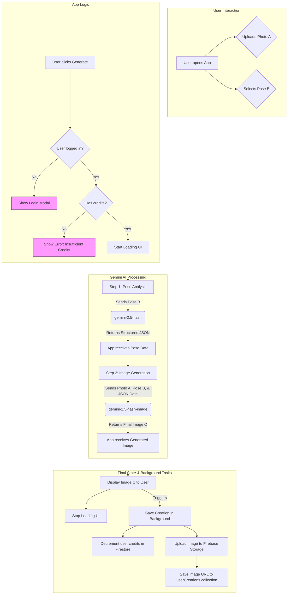

# PoseShift Project Documentation

## 1. Project Overview

**PoseShift** is a web application powered by cutting-edge AI that allows users to transfer the pose from a reference image to their own photo. The core functionality revolves around uploading a personal photo, selecting a pose from a gallery or uploading a custom one, and letting the AI generate a new image that combines the user's likeness, clothing, and background with the selected pose.

**Target Audience:**
The application is designed for a broad audience, including:
*   **Content Creators & Social Media Influencers:** To quickly create dynamic and engaging photos for their platforms.
*   **E-commerce Managers:** To generate consistent and varied product try-on images without expensive photoshoots.
*   **Designers & Artists:** For rapid character concepting, storyboarding, and creative exploration.
*   **General Users:** For fun, creative photo editing and experimentation.

**Core Features:**
*   User-friendly interface for uploading a source image and a pose image.
*   Extensive gallery of predefined pose templates categorized for easy browsing.
*   Ability to upload custom pose images.
*   AI-powered generation engine that preserves user identity, clothing, and background.
*   User authentication system (Email/Password & Google) for managing creations and credits.
*   Credit-based system for image generation with a free trial for new users.
*   User account management for viewing past creations, managing billing, and updating settings.
*   A blog with tutorials, product updates, and company news.

---

## 2. Project Flowchart

This diagram illustrates the primary user journey for generating an image.



---

## 3. Version Management

### 3.1 Current Version
The current version, as specified in `metadata.json`, is **"测试开发版251029-AI Pose Shifter"**. For production, a more structured versioning system is recommended.

### 3.2 Recommended Versioning Scheme
We will adopt **Semantic Versioning (SemVer)** using the `MAJOR.MINOR.PATCH` format:
*   **MAJOR** version when you make incompatible API changes.
*   **MINOR** version when you add functionality in a backward-compatible manner.
*   **PATCH** version when you make backward-compatible bug fixes.

Example: `1.0.0`

### 3.3 Changelog
A `CHANGELOG.md` file should be maintained in the project root to document all notable changes for each version. This provides transparency for both the development team and users.

### 3.4 Branching Strategy
A simplified Gitflow branching strategy is recommended:
*   `main`: This branch contains production-ready code. All deployments are made from this branch.
*   `develop`: This is the integration branch for new features. All feature branches are merged into `develop`.
*   `feature/<feature-name>`: Developers create feature branches from `develop` to work on new functionalities (e.g., `feature/batch-processing`). Once complete, they are merged back into `develop`.
*   `hotfix/<fix-name>`: For urgent production bug fixes, created from `main` and merged back into both `main` and `develop`.

---

## 4. Technical Stack

The project is built with a modern, serverless-oriented architecture.

*   **Frontend Framework:**
    *   **React 19:** For building the user interface.
    *   **TypeScript:** For static typing, improving code quality and maintainability.
    *   **ReactDOM:** For rendering React components in the browser.

*   **Styling:**
    *   **Tailwind CSS:** A utility-first CSS framework for rapid UI development, loaded via a CDN script.

*   **AI & Machine Learning:**
    *   **Google Gemini API (`@google/genai`):** The core engine for all AI-driven tasks.
        *   `gemini-2.5-flash`: Used for analyzing poses from images and generating structured JSON descriptions.
        *   `gemini-2.5-flash-image`: Used for the primary task of generating the final image by combining the user photo with the analyzed pose.

*   **Backend as a Service (BaaS):**
    *   **Firebase:** Provides a comprehensive suite of backend services.
        *   **Firebase Authentication:** Handles user sign-up, login (Email/Password, Google), and session management.
        *   **Firestore:** A NoSQL database used to store user profiles (including credit balance) and metadata for user-generated creations.
        *   **Firebase Storage:** Used to store the actual image files generated by users.

*   **Tooling & Environment:**
    *   **ES Modules & Import Maps:** The project uses native browser ES modules. Dependencies like React and `@google/genai` are loaded directly from a CDN (`aistudiocdn.com`) via an `importmap` in `index.html`, eliminating the need for a local bundling step during development.

---

## 5. Project Structure

The project is organized into logical directories based on functionality.

```
.
├── index.html              # The main HTML entry point for the application.
├── index.tsx               # The main TypeScript file that mounts the React app.
├── README.md               # This documentation file.
├── metadata.json           # Application metadata.
├── App.tsx                 # The root React component, handling state, routing, and layout.
├── constants.ts            # Stores static data, primarily the pose templates array.
├── components/
│   ├── ImageUploader.tsx     # Component for uploading the user's source photo.
│   ├── PoseGallery.tsx       # Component displaying pose templates and handling custom uploads.
│   ├── GeneratedImage.tsx    # Component to display the final AI-generated image, loading states, and errors.
│   ├── HistoryPanel.tsx      # Displays a small gallery of recently generated images.
│   ├── StepCarousel.tsx      # Animated carousel on the homepage explaining the 3-step process.
│   ├── PricingSection.tsx    # Component detailing subscription and credit pack pricing.
│   ├── Testimonials.tsx      # Displays user testimonials in a scrolling animation.
│   ├── Faq.tsx               # An accordion-style FAQ component.
│   ├── Footer.tsx            # The site-wide footer.
│   ├── ContactModal.tsx      # A modal for displaying contact information.
│   ├── icons.tsx             # A collection of SVG icons used throughout the app.
│   └── auth/
│       └── AuthModal.tsx       # Modal for user login and signup.
│   └── account/
│       ├── MyCreations.tsx     # Tab content for viewing user's saved creations.
│       ├── Billing.tsx         # Tab content for viewing and managing billing/plans.
│       ├── Credits.tsx         # Tab content for viewing credit balance and history.
│       └── AccountSettings.tsx # Tab content for managing user profile information.
├── contexts/
│   └── AuthContext.tsx       # React Context for managing global authentication state and user profile data.
├── pages/
│   ├── AccountPage.tsx       # The main page for user account management, which renders different tabs.
│   ├── BlogPage.tsx          # The blog page, which displays a list of articles and a detail view.
│   └── legal/
│       ├── LegalContent.tsx    # Contains the JSX content for all legal pages.
│       ├── LegalPage.tsx       # A component that renders the correct legal content based on a 'type' prop.
│       └── LegalPageLayout.tsx # The shared layout/styling for all legal pages.
├── services/
│   ├── geminiService.ts      # Contains all logic for interacting with the Google Gemini API.
│   └── firebase.ts           # Initializes and exports Firebase services (Auth, Firestore, Storage).
└── utils/
    └── fileUtils.ts          # Utility functions for file handling (e.g., base64 conversion, downloading).
```

---

## 6. Core Features and Logic

### 6.1 Authentication Flow
1.  **Provider (`AuthContext.tsx`):** This context wraps the entire application. It listens for `onAuthStateChanged` from Firebase to track the current user.
2.  **Profile Sync:** When a user logs in, the context fetches their corresponding profile from the "userProfiles" collection in Firestore to get additional data like credit count. It uses an `onSnapshot` listener to keep this data in sync in real-time.
3.  **New User Creation:** Upon signup (or first-time Google login), a new document is created in the "userProfiles" collection, and the user is granted an initial 30 credits.
4.  **UI Integration:** The `useAuth()` hook provides user data to components. This is used in the `Header` to show either "Log In/Sign Up" buttons or the user menu, and in `App.tsx` to gate the image generation functionality.

### 6.2 Image Generation Workflow
This is the core logic of the application, orchestrated within `App.tsx`'s `handleGenerate` function.

1.  **User Action:** The user uploads a photo (Image A) via `ImageUploader` and selects a pose (Image B) from `PoseGallery`.
2.  **Pre-flight Checks:** `handleGenerate` in `App.tsx` is triggered. It first checks if the user is logged in and has sufficient credits.
3.  **Loading State:** The application enters a loading state, updating the UI to provide feedback.
4.  **Pose Analysis (Step 1):** It calls `generatePoseDescription` from `geminiService.ts`. This function sends the pose image (Image B) to the `gemini-2.5-flash` model with a specific prompt and a JSON schema. The model returns a structured JSON object detailing the pose (head position, arm angles, etc.). This structured data is crucial for precise replication.
5.  **Image Generation (Step 2):** It then calls `generatePoseImage` from `geminiService.ts`. This function constructs a highly detailed prompt that includes:
    *   The user's photo (Image A).
    *   The pose reference photo (Image B).
    *   The structured JSON pose data from the previous step (as the "ground truth").
    *   A set of critical rules instructing the AI to prioritize pose transfer while preserving identity, clothing, and background.
    *   This combined payload is sent to the `gemini-2.5-flash-image` model.
6.  **Result Handling:** The model returns the final image as a base64 string.
7.  **State Update:** `App.tsx` updates its state with the new image, which is displayed in the `GeneratedImage` component. The loading state is turned off.
8.  **Background Save:** A background process (`saveCreationInBackground`) is kicked off to:
    *   Convert the base64 image to a Blob.
    *   Upload the Blob to Firebase Storage.
    *   Get the public download URL.
    *   Decrement the user's credit count in their Firestore profile document.
    *   Create a new document in the "userCreations" collection linking the user's ID to the image URL.

### 6.3 State-Based Routing
The application uses a simple routing mechanism controlled by a `useState` hook in `App.tsx`: `const [page, setPage] = useState<Page>('home');`. The `navigate` function simply updates this state. A `switch` statement in `renderContent` determines which top-level page component (`HomePage`, `BlogPage`, `LegalPage`) to render based on the current `page` state value.

---

## 7. Getting Started

### 7.1 Prerequisites
*   A modern web browser with support for ES Modules.
*   A local web server to serve the files (e.g., VS Code's "Live Server" extension or `npx serve`).

### 7.2 Environment Variables
The application requires a Google Gemini API key. This key must be made available as an environment variable named `process.env.API_KEY`. In a local development environment, you would typically use a tool like `dotenv` or your IDE's settings to provide this. For production, this would be configured in the hosting environment.

### 7.3 Running Locally
1.  Clone the repository.
2.  Set up your environment variable for the API key. For example, if using a tool that reads `.env` files, create a `.env` file in the root and add your API key: `API_KEY=your_gemini_api_key_here`.
3.  Start a local web server in the project's root directory.
4.  Open `http://localhost:[port]` in your browser.
